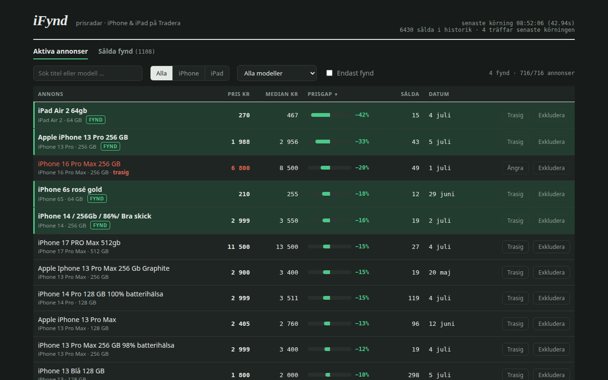
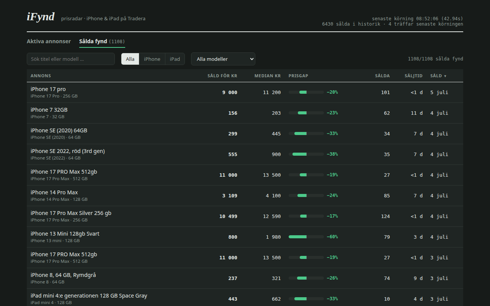

# iFynd

A little Go service that watches [Tradera](https://www.tradera.com) for
underpriced iPhones and iPads. It keeps its own history of what every model
actually sells for, then flags köp nu listings that sit well under that.

The **Aktiva annonser** tab is the radar: everything for sale right now,
compared against the median sold price for that exact model and storage.
Deals show up green. If a deal turns out to be a cracked screen in disguise,
one click marks it broken (red) and its price stays out of the statistics.



**Sålda fynd** is hindsight: every sale in the last 90 days that went below
the median, and how long the listing was up before someone grabbed it. The
good ones tend to go within a day, which is the whole reason this runs on a
timer instead of me refreshing the site.



## How it works

Tradera's category pages are Next.js apps that ship the entire search result
as JSON inside `self.__next_f.push()` script chunks, so there is no HTML
parsing involved. The JSON also carries structured attributes (model,
storage, condition) that are far more reliable than whatever the seller
typed in the title.

Each cycle (every 30 minutes by default):

1. Scrape sold listings into an append-only price history. A category with
   no history yet gets backfilled with everything Tradera still serves,
   roughly 90 days. After that it only reads back `IFYND_SOLD_WINDOW_DAYS`.
2. Scrape the active fixed-price listings, deduped on Tradera's listing id.
3. Sort every listing into a (model, storage) bucket. iPhone listings
   usually have usable attributes. iPad listings have none, so the title
   parser has to know that "3:e gen", "M1" and "2021" can all mean the same
   device. Anything it can't classify with confidence gets skipped and
   logged to `skipped_listings`, because a wrong guess in the price history
   is worse than a missing data point. That covers accessories, bundles,
   parts phones, multi-device lots and titles that are just "iPad".
4. Compute a median (or trimmed mean) per bucket and flag active listings
   more than `IFYND_THRESHOLD_PCT` below it. Buckets with fewer than
   `IFYND_MIN_SAMPLES` sales are ignored entirely.
5. Notify once per listing, ever. The notifier is an interface with a log
   stub behind `IFYND_NOTIFIER`; ntfy or Discord can be added in
   `internal/notify`.

## Run

```sh
go run . --once        # single scrape+compare cycle
go run .               # loop every IFYND_INTERVAL (default 30m) + HTTP API
docker compose up -d   # on the VPS; SQLite lives in the ifynd-data volume
```

## Web GUI

`http://<host>:8080/` serves a single-page dashboard baked into the binary.
Filters for family (iPhone/iPad), model, free text and hits-only. Each active
row has two buttons:

- **Trasig** marks a broken device. The row turns red, it can never be a
  hit, and if the phone later sells its price is blocked from the history.
  Ångra undoes it.
- **Exkludera** deletes the listing and remembers the id, so the next
  scrape can't quietly re-add it.

## HTTP API

- `GET /healthz`
- `GET /api/status` — last run stats
- `GET /api/listings` — active listings with computed references and flags
- `POST /api/listings/{id}/broken` — body `{"broken": true|false}`
- `POST /api/listings/{id}/exclude` — delete + tombstone a listing
- `GET /api/bargains` — historical below-median sales with days-to-sell
- `GET /api/hits` — hits from the most recent run
- `GET /api/buckets` — sold-price buckets (count/min/max/mean)

## Configuration (env)

| Variable | Default | Meaning |
|---|---|---|
| `IFYND_DB_PATH` | `ifynd.db` | SQLite path (`/data/ifynd.db` in Docker) |
| `IFYND_INTERVAL` | `30m` | Scrape interval |
| `IFYND_THRESHOLD_PCT` | `15` | Min % below reference to count as a hit |
| `IFYND_MIN_SAMPLES` | `5` | Min sold records before trusting a bucket |
| `IFYND_MIN_PRICE` | `100` | Skip listings priced below this (junk/scams) |
| `IFYND_METRIC` | `median` | `median` or `trimmed_mean` |
| `IFYND_TRIM_PCT` | `10` | Trim per tail for `trimmed_mean` |
| `IFYND_LOOKBACK_DAYS` | `90` | Sold-history window for references |
| `IFYND_SOLD_WINDOW_DAYS` | `14` | Incremental sold-scrape depth |
| `IFYND_SOLD_MAX_PAGES` | `20` | Page cap per incremental sold scrape |
| `IFYND_BACKFILL_PAGES` | `100` | Page cap for first-run backfill |
| `IFYND_ACTIVE_MAX_PAGES` | `25` | Page cap for active scrape |
| `IFYND_REQUEST_DELAY` | `1500ms` | Delay between page fetches (+ jitter) |
| `IFYND_NOTIFIER` | `log` | Notification channel |
| `IFYND_HTTP_ADDR` | `:8080` | API listen address |
| `IFYND_CATEGORIES` | `340186:iphone,342496:ipad` | Tradera categories as `<id>:<family>` pairs |
